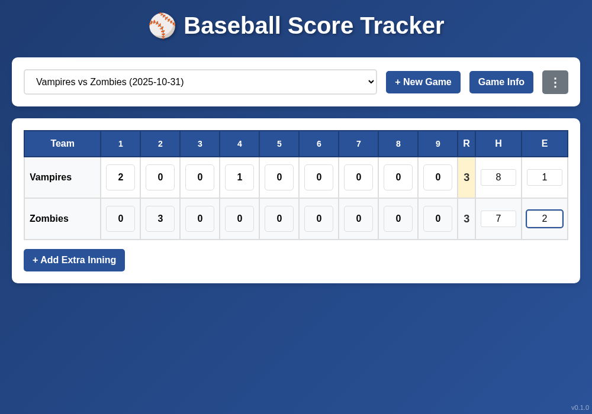

# Baseball Score Tracker

A simple, intuitive web application for tracking baseball game scores. Perfect for coaches, scorekeepers, or anyone who wants to keep track of baseball games.



## Features

- **Easy Score Entry**: Click on any inning cell to enter scores with inline editing
- **Multiple Games**: Create and manage multiple games with automatic persistence
- **Game Information**: Track game date, start time, and custom notes
- **Complete Statistics**: Track runs, hits, and errors for both teams
- **Extra Innings**: Support for games that go into extra innings
- **Mobile Responsive**: Works seamlessly on desktop and mobile devices
- **Auto-save**: All data is automatically saved to local storage
- **Smart Scroll Indicator**: Automatically shows scroll hints when extra innings extend beyond viewport

## Getting Started

### Installation

1. Clone or download this repository
2. No installation required - it's a single HTML file!

### Running the App

```bash
npm start
```

This will start a local web server on port 1876 and open the app in your browser.

Alternatively, simply open `index.html` in any modern web browser.

## How to Use

### Creating a Game

1. Click the **+ New Game** button
2. A new game will be created with default team names

### Editing Team Names

- Click on any team name to edit it
- Changes are saved automatically

### Recording Scores

1. Click on any inning cell to enter a score
2. The cell automatically selects all text for quick data entry
3. Total runs (R) are calculated automatically
4. Enter hits (H) and errors (E) in the respective columns

### Game Information

- Click the **Game Info** button to view and edit:
  - Game date
  - Start time
  - Custom notes about the game
- All changes are saved when you click **Save**

### Extra Innings

- Click **+ Add Extra Inning** to extend the game beyond 9 innings
- The scoreboard will scroll horizontally on smaller screens
- Use the scroll indicator in the lower right to navigate

### Managing Games

- Use the dropdown menu at the top to switch between games
- Click the **⋮** menu to access:
  - **Export Games**: Download all games as a JSON file for backup
  - **Import Games**: Restore games from a previously exported JSON file
  - **Reset Scores**: Clear all scores for the current game
  - **Delete Game**: Permanently remove the current game
  - **Delete All Games**: Remove all games from the app

## Features in Detail

### Auto-Select on Focus
When you click on any score field, the current value is automatically selected, making it easy to quickly replace values without manual deletion.

### Responsive Design
The app adapts to different screen sizes:
- Desktop: Full scoreboard view
- Mobile: Horizontal scrolling with smart scroll indicators
- Touch-friendly input fields

### Data Persistence
All game data is stored in your browser's local storage, so your games are preserved even if you close the browser.

### Visual Feedback
- Hover effects on interactive elements
- Color-coded destructive actions (red for delete/reset)
- Highlighted total runs column (yellow)
- Clear visual hierarchy

## Technical Details

- **Pure HTML/CSS/JavaScript**: No frameworks or dependencies
- **LocalStorage API**: For data persistence
- **Responsive CSS**: Media queries for mobile optimization
- **Single File**: Everything in one HTML file for easy deployment

## Browser Compatibility

Works in all modern browsers:
- Chrome/Edge (latest)
- Firefox (latest)
- Safari (latest)
- Mobile browsers (iOS Safari, Chrome Mobile)

## Version

Current version: **v0.1.0**

## License

MIT

## Contributing

Feel free to submit issues or pull requests for improvements!
